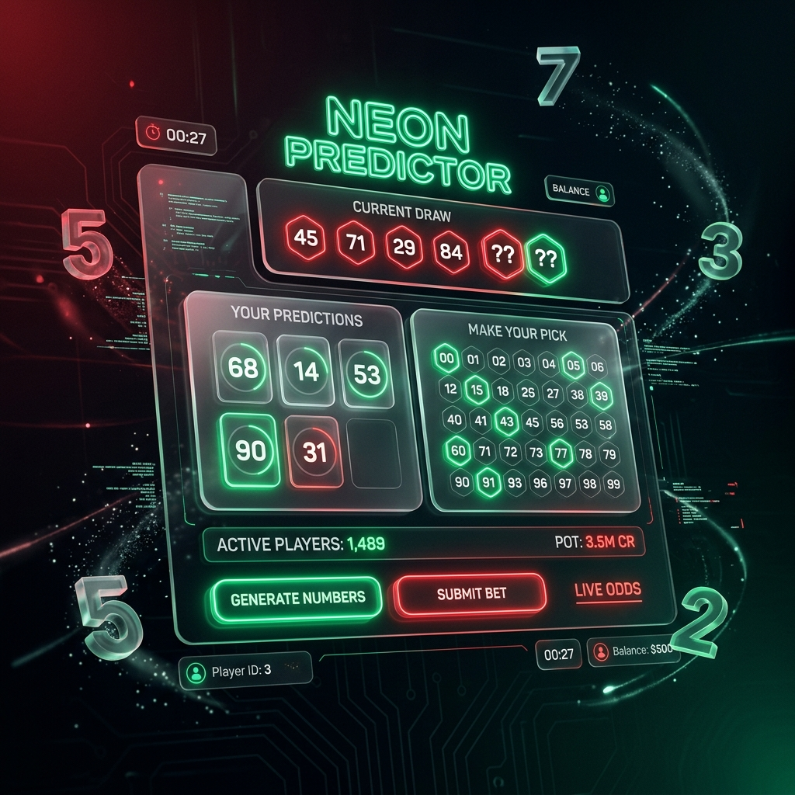

# 🎲 NUMBER-PREDICTOR: Premium Gaming Experience



A sleek, high-performance number prediction game featuring a state-of-the-art glassmorphic interface, dynamic feedback systems, and a premium dark-mode aesthetic.


---

## 🔗 Quick Links
- **Live Demo**: [https://number-prediction-omega.vercel.app](https://number-prediction-omega.vercel.app)
- **GitHub Repository**: [https://github.com/nijjukrr/number-prediction](https://github.com/nijjukrr/number-prediction)

---

## ✨ Key Features
- **🎯 Precise Logic**: Real-time evaluation of guesses with instant high/low feedback.
- **✨ Glassmorphic UI**: Translucent cards with subtle neon glow effects and blur filters.
- **📈 Score Tracking**: Persistent "Best Score" tracking using local storage.
- **💫 Interactive Animations**: Smooth shake effects on errors and pop animations on victory.
- **📱 Ultra-Responsive**: Optimized for all devices, from mobile phones to desktop monitors.

## 🛠️ Tech Stack
- **Structure**: Semantic HTML5
- **Styling**: Vanilla CSS3 (Custom Design System, Flexbox, Keyframe Animations)
- **Logic**: ES6+ JavaScript
- **Deployment**: Vercel

## 🚀 Getting Started

### Prerequisites
A modern web browser (Chrome, Firefox, Edge, or Safari).

### Installation
1. Clone the repository:
   ```bash
   git clone https://github.com/nijjukrr/number-prediction.git
   ```
2. Navigate to the project directory:
   ```bash
   cd number-prediction
   ```
3. Open `index.html` in your favorite browser.

---

Developed with ❤️ by [Nishanth KR](https://github.com/nijjukrr)
